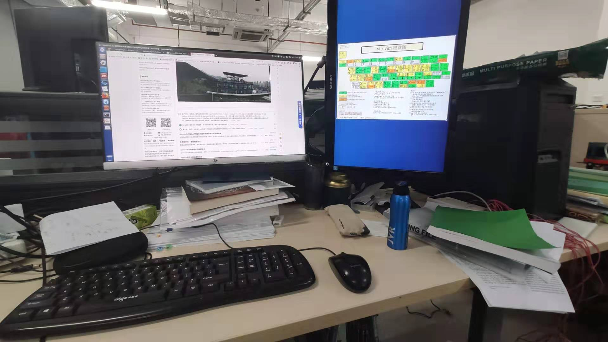
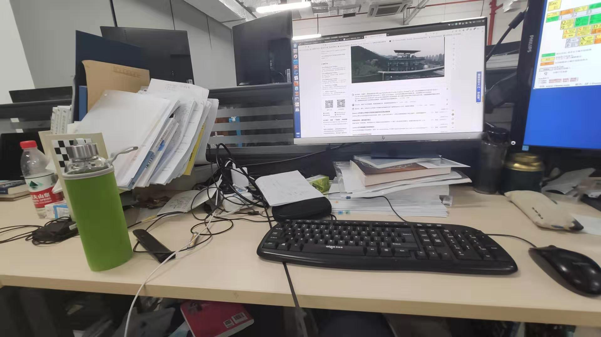
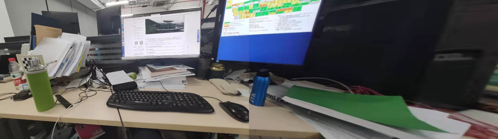

# EpsAvlc_toys

This repo stores codes I code when I don't want to study in lab.

## image_stitching

1. feature matching
2. calculate homography
3. warp perspective

### images before stitching

</img></img>

### images after stitching

</img>
